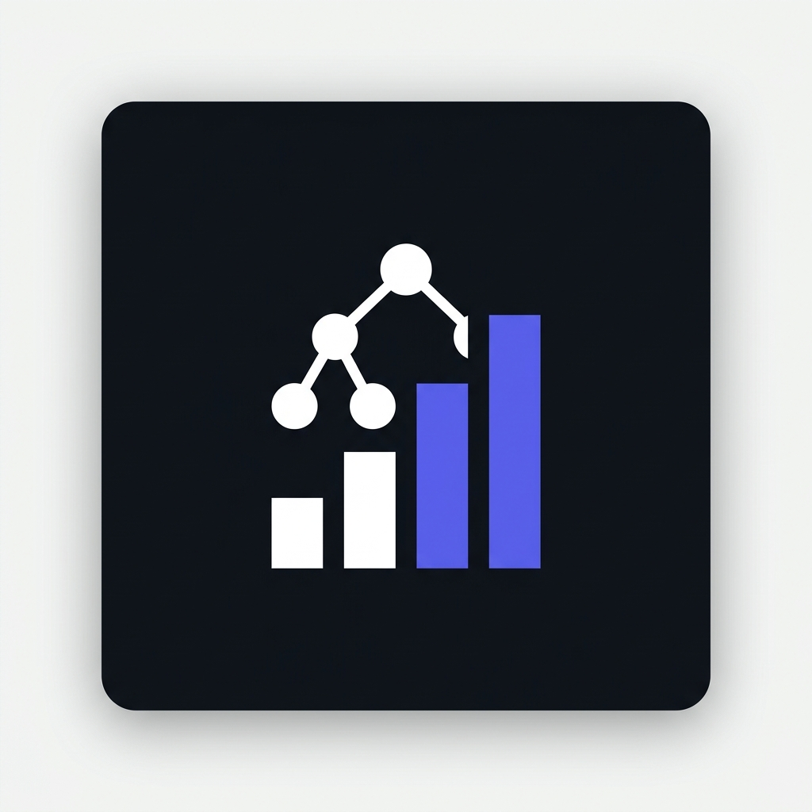
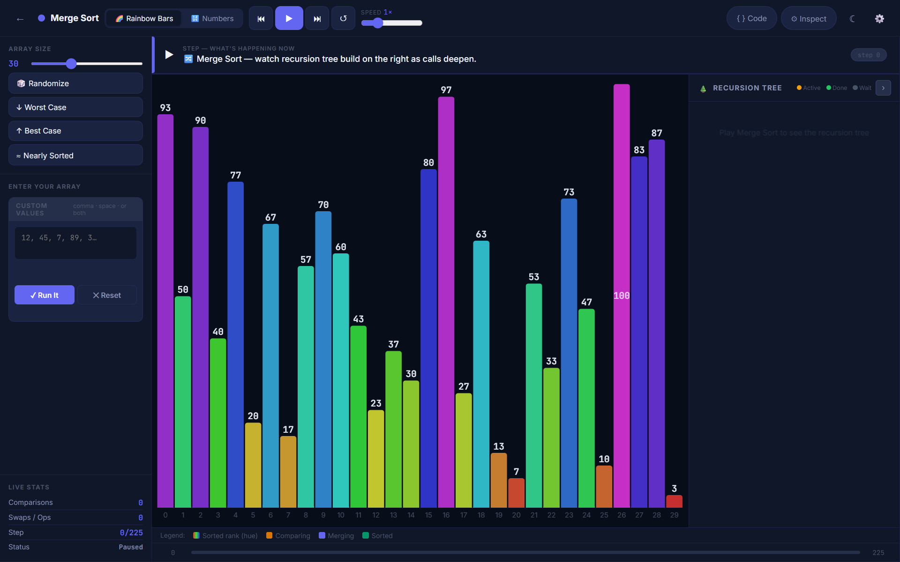
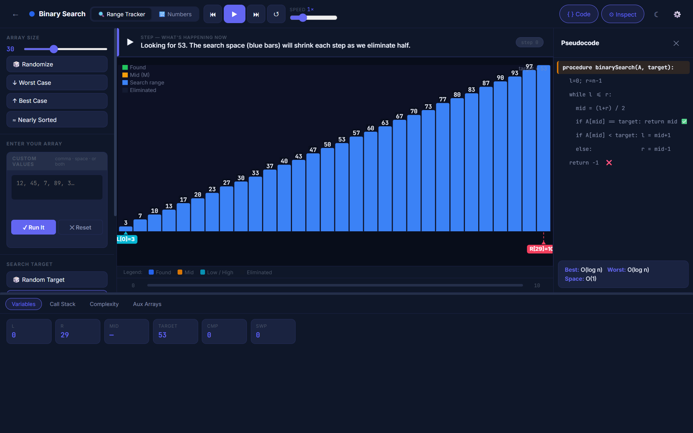

  

# ⚡ Algo Untangled
> **See Inside the Algorithms.** A deeply interactive visualization tool built to make complex algorithms accessible.

## ⭐ What Makes This Unique?
There are hundreds of algorithm visualizers on the internet, but **Algo Untangled** was built differently. Here is what sets it apart:

- 🕒 **Time-Travel Scrubbing:** You don't just watch an animation. You can pause, step forward, or step backward through the exact state of the algorithm at any moment using a timeline scrubber or your arrow keys.
- 🗣️ **Plain-English Narration:** No confusing jargon. A live narration box explains *exactly* what the algorithm is doing at each step in simple, easy-to-understand English.
- 🔍 **Deep Inspection:** See beyond the visual bars. Open the Inspector Panel to peek into the Call Stack, track execution Variables, and watch Auxiliary Arrays (like Merge Sort's L and R arrays) populate in real-time.
- 🏎️ **Side-by-Side Comparison Racing:** Run two algorithms simultaneously in a race. Watch progress bars, operation counts, and theoretical vs. actual complexity charts update live to see which algorithm truly scales better.
- 🪶 **Absolute Minimalism (Zero Dependencies):** Built entirely from scratch in a single file using pure Vanilla ES6 JavaScript, HTML5, and CSS3. No React, no Vue, no Webpack, no NPM.

<!-- ADD HERE — right after the tagline, before the feature list -->

 
  
  

<!-- END SCREENSHOTS -->

## 📖 About the Project
Passionate about making complex data structures understandable, this was built as a deep-dive project. Every single data structure, render loop, and animation was written entirely from scratch. By slowing down execution and mapping values to crisp, device-pixel-ratio-aware HTML5 canvas visuals, it untangles the "magic" behind algorithms and turns them into something you can interact with.

## 🧮 Algorithms Included
To keep the focus on depth and quality, the visualizations are restricted to five fundamental algorithms:
1. **Bubble Sort** (Array / Bars)
2. **Merge Sort** (Array / Bars + Live Recursion Tree)
3. **Binary Search** (Range Tracker)
4. **Breadth-First Search (BFS)** (Node Graph & Maze Grid)
5. **Depth-First Search (DFS)** (Node Graph & Maze Grid)

## 👨‍💻 Author
Built from scratch by **Thrinay Thirunahari**.
- Email: thrinaythirunahari@outlook.com
- GitHub: [@clouddt-Cod](https://github.com/clouddt-Cod)
- LinkedIn: [Thrinay Thirunahari](https://www.linkedin.com/in/thrinay-thirunahari-ab9249398)
